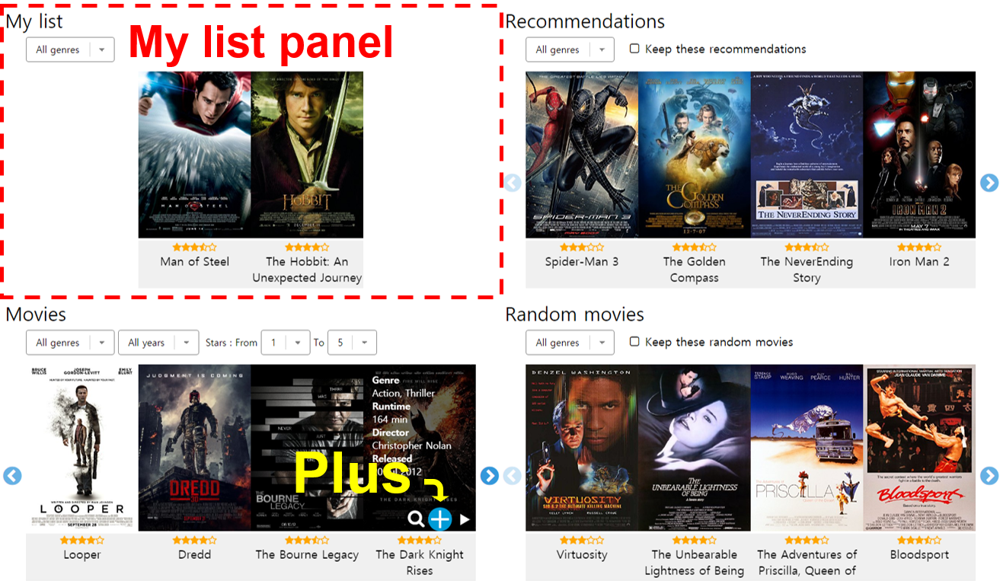

# "My list" panel

The <code>My list</code> panel is a list of temporary candidates like a shopping cart. If you find interesting movies on other panels, you can put them here by clicking <a href="../interactions/plus.md"><code>plus</code></a> button. This allows you to manage your candidates without having to remember them.

Our system recommends similar movies to those in the <code>My list</code>.  
Whenever, you change the <code>My list</code>, the <a href="./rec.md"><code>Recommendations</code></a> & <a href="./rand.md"><code>Random movies</code></a> panels are automatically updated.

