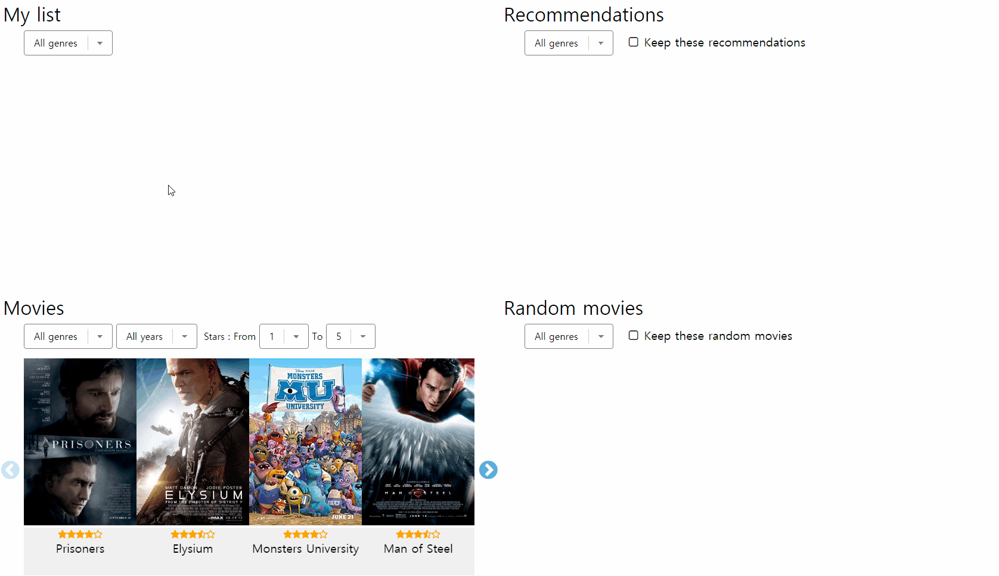

# Filter

You can filter out the <a href="../four-main-view/movies.md"><code>Movies</code></a> panel by using <code>genre</code>, <code>year</code>, <code>ratings</code>. Also the other panels can be filtered out by using <code>genre</code>.  
The <a href="../four-main-view/movies.md"><code>Movies</code></a> panel have 1030 movies, which means you should use these filters to find the movie you want to watch now.

