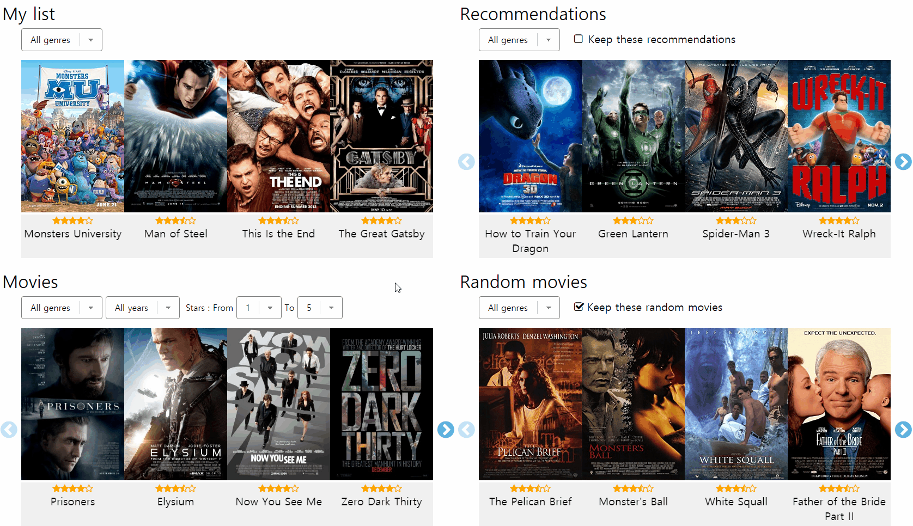

# Mouse-hover
  

If you mouse-hover a movie poster (not title!), detailed informations of the movie (Genre, Runtime, Director, Released) and three buttons (<a href="../interactions/magnifier.md"><code>Magnifier</code></a>, <a href="../interactions/plus.md"><code>Plus</code></a> or <a href="../interactions/plus.md"><code>Minus</code></a>, <a href="../interactions/play.md"><code>Play</code></a>) appear.

