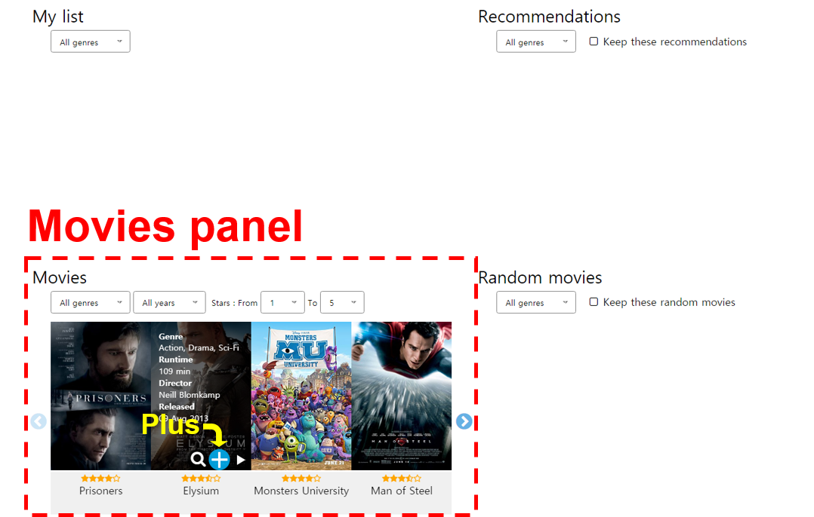

# 1. "Movies" panel

The <code>Movies</code> panel is main movie list containing 1030 movies.  
When you first start, the movies are in only the <code>Movies</code> panel. To get recommendations (or fill other panels with movies), you should use <a href="../interactions/plus.md"><code>plus</code></a> button.
